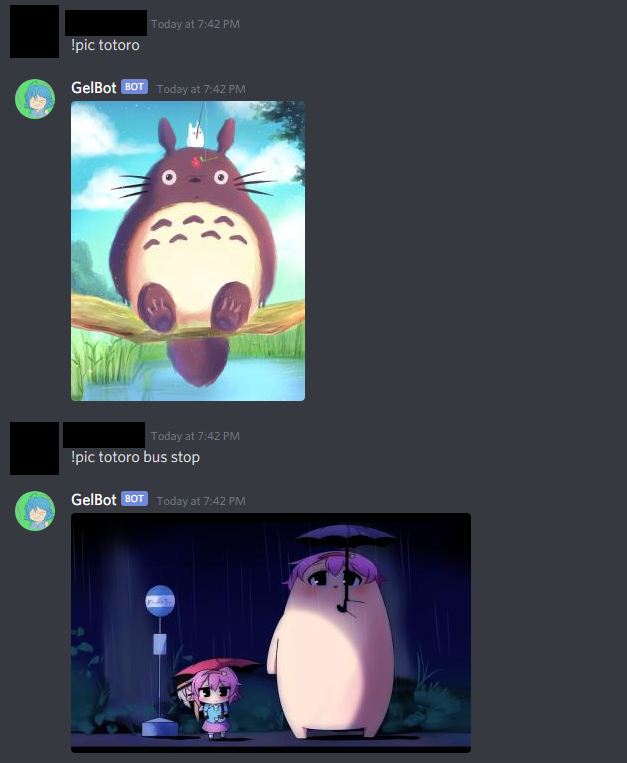

# GelBot

A Discord bot that sends pictures from Gelbooru with given tags. Using Discord and Gelbooru APIs.

For now the only way to add bot to your server is through the link below:

[Invite bot](https://discord.com/api/oauth2/authorize?client_id=792404596688683019&permissions=117760&scope=bot)

Here is shown how it works in practice:



##### Commands:
- !pic - main command for getting your picture
- !gelhelp - a help command, shows you everything you need to know
- !gelexamples - shows a couple examples of !pic usage
- !gelratings - shows info about ratings usage
- !gelnote - shows my disclaimer which can be found also [here](https://github.com/bubo-py/GelBot/blob/master/notes.py)

The !pic command syntax:  
!pic [optional rating] tag/tag with a space/tag/tag


##### Main requirements:
```
discord.py==1.5.1
requests==2.25.1
```

## License
GelBot's code can be used for any purposes under the [MIT License](LICENSE)
